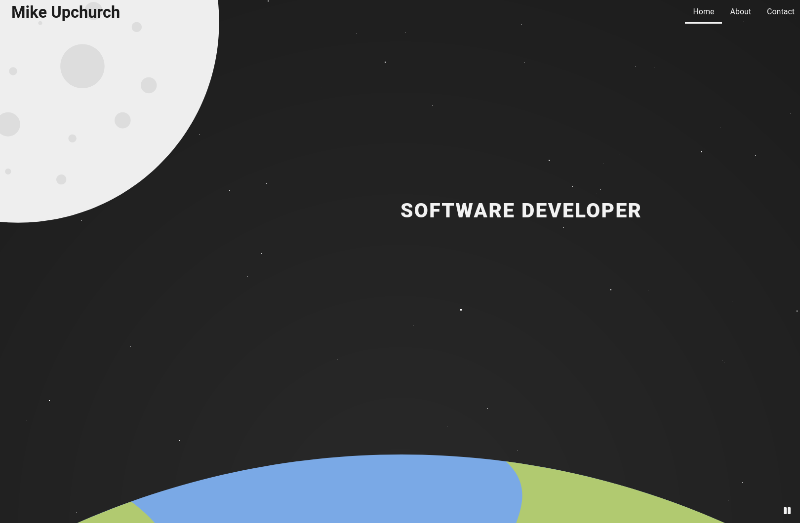

# mikeup.church

A personal website for myself, Mike Upchurch. Visit it [here](http://wwwmikeup.church).

Built using Gatsby.

## Developing

First time setup: `npm install`

`npm run develop` - pages will hot reload on edit of any file

### Updating content

All project and blog content is located in the `/content` folder under `/about` and `/blog`, respectively.

Simply update/write markdown to edit or add any pages.

## Deploying

`npm run deploy` - this will build and deploy the site to Github Pages via the `master` branch