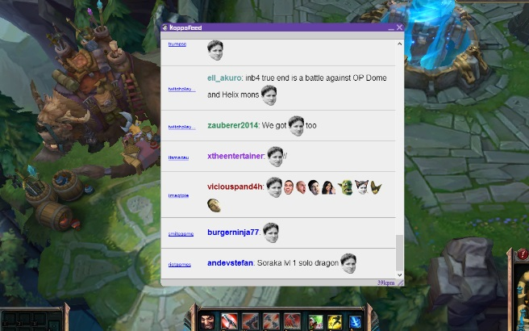

## What is it?

Kappafeed is a program that listens in top [Twitch.tv](http://www.twitch.tv/) channel chatrooms for whichever emoticon the user has selected, and displays all messages in one collective feed. It integrates with Twitch APIs and IRC servers in order to merge the top chat channels into one feed.

At one point, I created a Kappafeed Overwolf app for a contest they were hosting and won a gaming headset.

## What did I learn?
I learned a lot about maintaining servers and keeping a service running reliably 24/7. Admittedly, the code for this project got a bit unruly as more features were added and more error handling of edge cases was added. I learned valuable lessons about code refactor and structure for future projects.

### Technologies

_Python, Tornado Web Server, IRC, Websockets, HTML, JQuery, CSS_