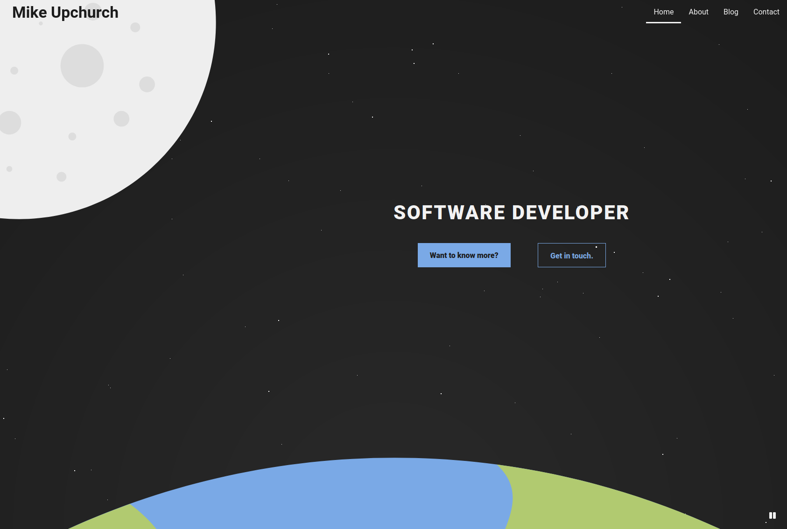

## What is it?

A personal website where I can showcase projects and write blog posts.

## What did I learn?

I used this as an opportunity to learn Gatsby. I appreciated the opportunity to write my personal website in React, and also wanted the ability to write blog posts using Markdown.

I wanted to improve the design for this latest iteration and spent a lot of time researching, learning, and sketching.

[View the source on Github.](https://github.com/mupchrch/mikeup.church)

### Technologies

_Gatsby, React, Sass_