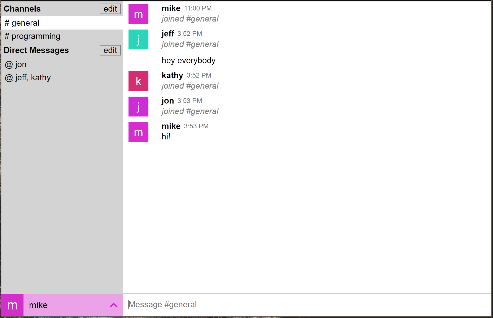

## What is it?

Upchat is a web app _heavily_ inspired by [Slack](https://slack.com). It supports channels, nested sub-channels, single/multi user direct messages, channel/user mentions, profile pictures, and more.

## What did I learn?

This project started as an excuse to learn Node.js, then exploded into an opportunity to learn many more aspects of creating and running a web app:

- I began with MongoDB and Mongoose, which I eventually outgrew. I realized what I actually needed was a relational database, so I chose Postgres with `node-postgres`. Choosing a lower level library like `node-postgres` allowed me to gain more experience writing SQL queries.
- I chose to roll my own user authentication via JSON Web Tokens, as this was another aspect of web apps that I wanted to learn more about.
- All server APIs are unit tested. All unit tests run with each commit via CircleCI.
- I learned how to set up a production Node.js server running via PM2 on a Digital Ocean droplet with an SSL certificate.

### Technologies

_Webpack, Node.js, Express, Websockets, JWT, Postgres, React, Sass, Mocha, Chai, CircleCI_