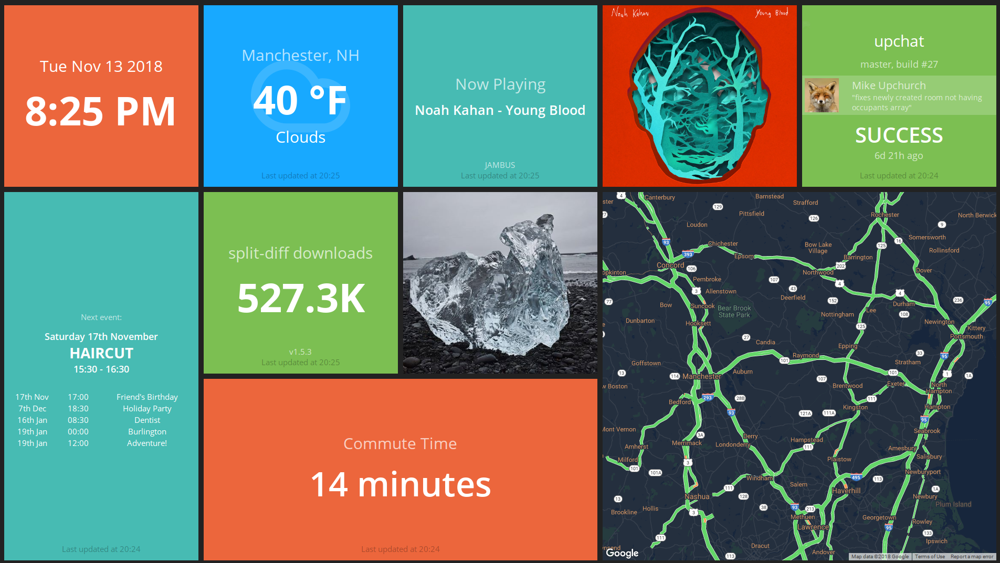

## What is it?

Updash is a personalized information dashboard for my home. It displays helpful things about my life such as commute time, currently playing music, weather, calendar, Instagram photos, etc.

## What did I learn?

It is built using Smashing (a Ruby-based framework for quickly constructing dashboards) and runs on a Raspberry Pi connected to a monitor. I had to customize many of the widgets as they were either no longer working or did not exist.

### Technologies

_Smashing, Ruby, Coffeescript, CSS_