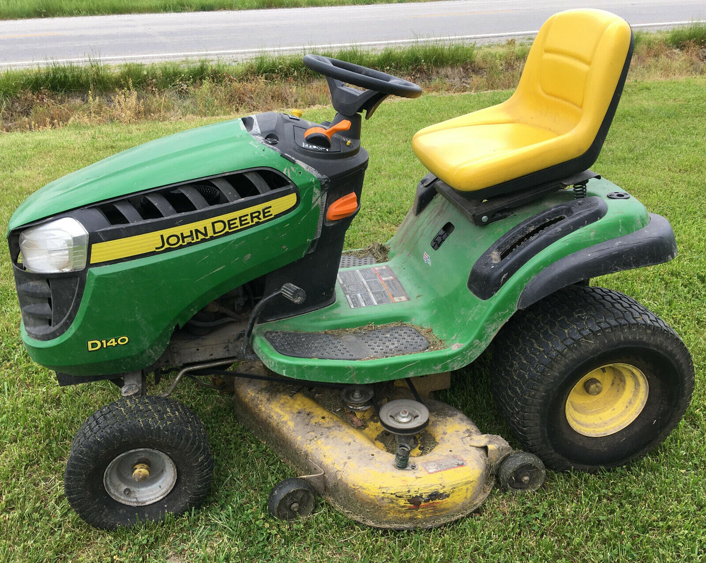

I have a John Deere D140 from 2003. While mowing my lawn, I hit a small rock with one of the blades. All seemed fine and I continued. The next time I started to mow, I heard this knocking, metal-on-metal noise. I immediately stopped and assumed the blade had broken to a point where it was nicking the deck.

## The diagnosis

So I bought [new blades](https://www.amazon.com/MaxPower-561812X-Commercial-Mulching-Replaces/dp/B010B3B22U/ref=sr_1_15?crid=3M1G7GXY2UMC9&amp;keywords=d140+mulch+blade&amp;qid=1698420498&amp;sprefix=d140+mulch+blade%252Caps%252C93&amp;sr=8-15&_encoding=UTF8&tag=upchurch-20&linkCode=ur2&linkId=421189c5cfbfb533aece1d8a0103dc57&camp=1789&creative=9325), [a breaker bar](https://www.amazon.com/Neiko-00200A-Extension-Chrome-Vanadium-Rotating/dp/B002GQ1O7E/ref=sr_1_2?crid=3Q9SHIKR1389R&amp;keywords=breaker+bar&amp;qid=1698420643&amp;sprefix=breaker+bar%252Caps%252C138&amp;sr=8-2&_encoding=UTF8&tag=upchurch-20&linkCode=ur2&linkId=a4f823ce0357272b3ea02ab028b96b82&camp=1789&creative=9325), and [a 15/16 socket](https://www.amazon.com/CRAFTSMAN-Shallow-Impact-16-Inch-CMMT15857/dp/B07QG49R2Y/ref=sr_1_2?crid=249BK0MF5C4Q&amp;keywords=socket%252B15%252F16&amp;qid=1698420711&amp;sprefix=socket%252B15%252Caps%252C112&amp;sr=8-2&amp;th=1&_encoding=UTF8&tag=upchurch-20&linkCode=ur2&linkId=c6386527e62e208421c2424f64ec26dc&camp=1789&creative=9325). I borrowed some 
[RhinoRamps](https://www.amazon.com/gp/search?ie=UTF8&tag=upchurch-20&linkCode=ur2&linkId=8efd760e76f197bea09cf5bc015f01d2&camp=1789&creative=9325&index=automotive&keywords=Rhino%20ramps), so I could get under the mower deck easily.

I drove the mower up onto the ramps, unplugged both spark plugs, and took a look at the blade that was making the noise. What I saw was a bit more than I anticipated - the spindle assembly had started destroying itself - the metal housing was stripping off.

There are 4 bolts that hold the spindle assembly to the mower deck. When I smacked that rock, I had sheared one of those bolts and the entire assembly became unstable, violently rocking itself to death. Looks like I would have to replace the whole spindle.

## The fix

As any project goes, we have some scope creep. The plan now was to remove the mower deck and replace all 3 spindles, blades, and the belt. It's my assumption that the belt and blades are originals from 2003. The belt appeared to be a couple millimeters from snapping.

I disconnected the belt and removed the pins connecting the mower deck to the mower. Deck removal was simpler than I expected. I then removed the spindle to ensure the bolt holes were not rusted through. There was minor wear on one hole due to our issue, but it should be okay. During this process, I broke 3 separate pieces of my old, hand-me-down socket set. Finally, a good excuse to "upgrade" to a set from this century. I got a $45 (59-Piece) Craftsman set, which included some deep drive sockets.

In the meantime, I ordered [3 new spindles](https://www.amazon.com/dp/B07D9ZR3W9?psc=1&amp;ref=ppx_yo2ov_dt_b_product_details&_encoding=UTF8&tag=upchurch-20&linkCode=ur2&linkId=1e41ca34e3cd41a28e6ebb37c61d804a&camp=1789&creative=9325), [a belt](https://www.amazon.com/dp/B07QPPYBWY?psc=1&amp;ref=ppx_yo2ov_dt_b_product_details&_encoding=UTF8&tag=upchurch-20&linkCode=ur2&linkId=56a96d90d3ec9014a6a4b9164ce349c5&camp=1789&creative=9325), and [these spindle reinforcement rings](https://www.amazon.com/dp/B0BX6BKHMG?psc=1&amp;ref=ppx_yo2ov_dt_b_product_details&_encoding=UTF8&tag=upchurch-20&linkCode=ur2&linkId=c13f8d7f755dfade89c9946ca4784192&camp=1789&creative=9325) to add some strength, as the area is getting some rust. Hopefully I can have time to address the rust in the spring (doubt).

I also removed the blades and cleaned the underside of the deck. Satisfying.

With the new parts installed, I used a (borrowed) grease gun to lube the new spindles, and then it was time to reinstall the deck to the mower and fire it up.

Success! Everything worked great - back to mowing!