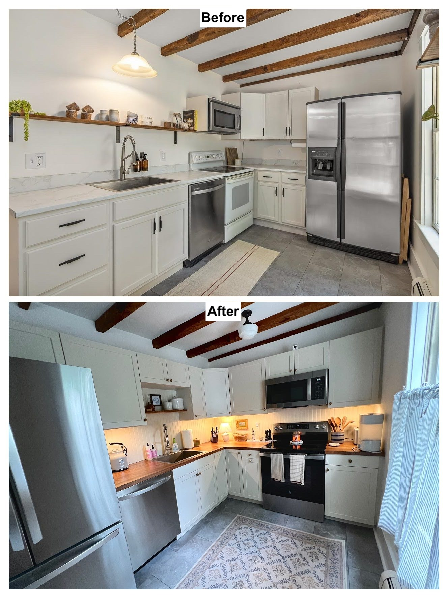
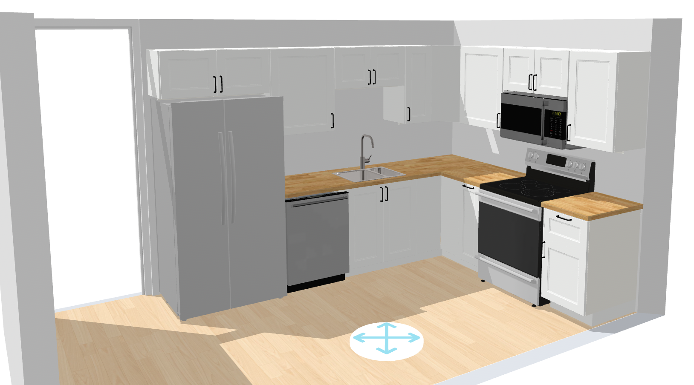
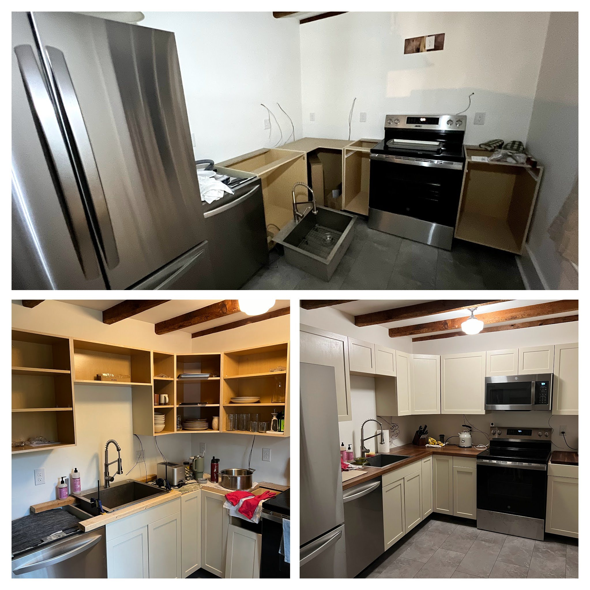
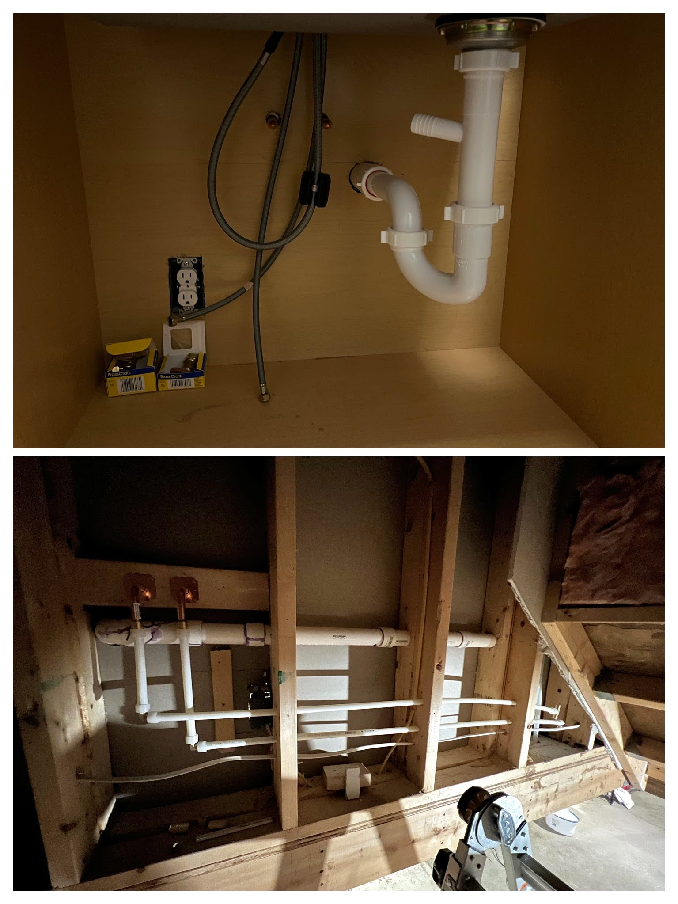

My wife and I purchased our first house 1 year ago. The kitchen was nice enough looking on the surface. However, there were some usability issues that we needed to address. And like any good HGTV show, we had a time constraint (baby on the way!)

## Issues

1. No storage
2. No trash bin
3. Stove in corner - cannot open oven door without smacking cabinet handles 🤦‍♂️
4. Fridge in corner - cannot fully open the door
5. No range hood

## Solutions

Ikea will solve all our problems. Or, at least, [their web-based kitchen planning tool](https://kitchen.planner.ikea.com/us/en/) will help us out. Below, you will find iteration number 6,253 😮‍💨

Should be straightforward, I just have to move every appliance and the kitchen sink. I started by ripping everything out. Interesting to find burgundy walls and checkerboard linoleum flooring.

The cabinets were ready to assemble Lowe's brand. I ended up painting them Benjamin Moore "Manchester Tan". I converted the lower cabinet to the left of the stove into a slide out trash bin. This was a _huge_ upgrade for us.

I hired an electrician to wire everything. He wired low voltage wires to all the right spots ahead of time and all I had to do was buy the LED strips and a driver and hook it up. Doing it myself helped saved a fair bit of money.

[As usual, I handled the plumbing](/blog/whole-house-water-filter-install). Luckily I had full access to a wall on the backside of the kitchen. I had to move hot/cold for the sink, reroute the sink drain, and add a hookup for the fridge. For the sink drain, it is now hooked up to an existing vent I found in the wall. Previously, some remodeler had just S-trapped the drain into the floor.

I cut and painted MDF beadboard for backsplash, and fastened it to the studs with brad nails. The butcher block counter was also purchased from Lowe's.

For appliances, we actually love the fridge and dishwasher from LG, but hate the stove from GE. The build quality is extremely poor - we had to get the touch pad controls replaced immediately (under warranty). Also, the stovetop is crooked to the body and the drawer is bent.

The last thing I did was cut a hole in the wall and vent the microwave range hood outside.