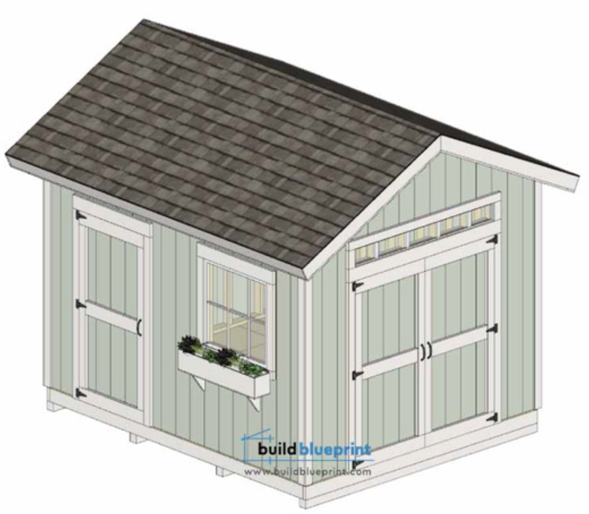
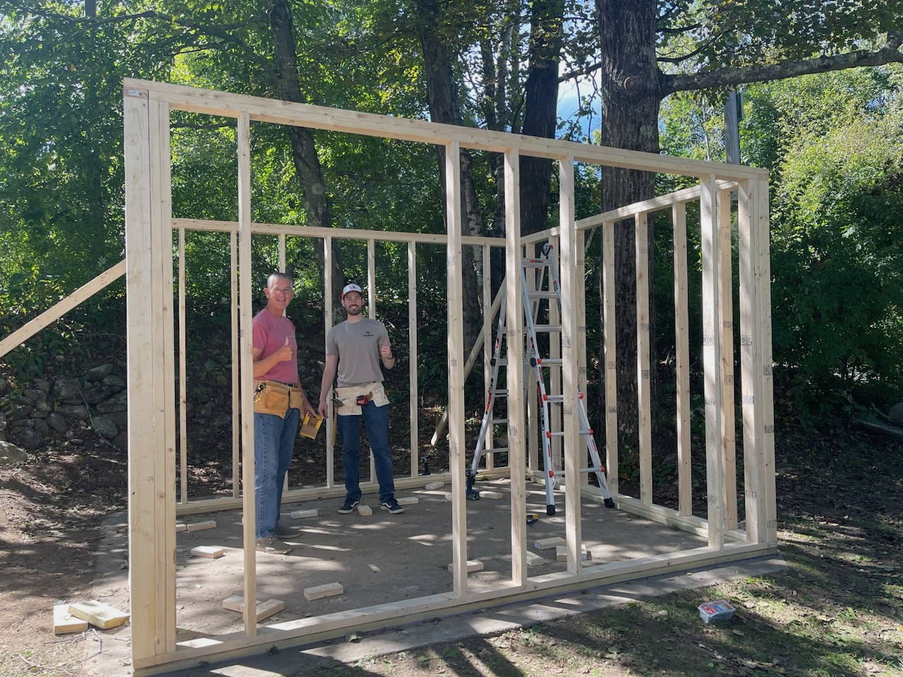
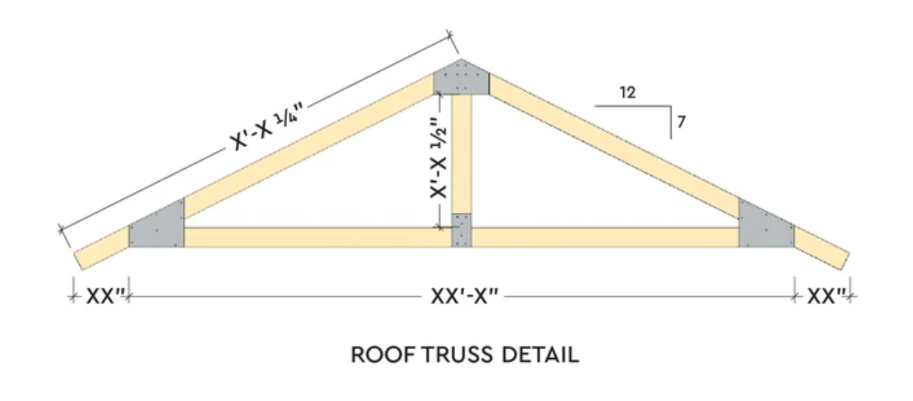

My wife and I purchased our first house this year, built in 1795. There is a dirt basement and a detached barn that can only be described as "hanging in there". Suffice to say, we have no storage space. However, we found a concrete pad near the driveway underneath years of leaves and decomposing firewood - a blank canvas - perfect for a shed?

## The plan

The plan was simple: Buy a shed. The concrete pad was about 13' x 13', so a 10' x 12' shed would fit nicely. After too many hours of research, I found a couple options:

1. $2000 - A "build-it-yourself" shed kit from the hardware store
2. $4500 - A fully built shed
3. $10 - [A shed plan](https://buildblueprint.com/12-x-10-garden-shed-plans/)

Option 3 it is! We can hopefully build it stronger, cheaper, and _prettier_ anyway. Thankfully, my father has the knowledge and tools to make this project possible.

## Wall framing

I ordered the lumber online from Home Depot. Despite not picking it myself, all the pieces were straight and usable.

The shed plan included instructions for building the floor, which we didn't need thanks to our trusty concrete. We started off by making sure the pressure-treated base was square and laid on foam sill sealer to keep any water out.

We then built and raised the first wall, which will have a 6' x 6' double door opening that I will be able to drive [my mower](/blog/fixing-lawn-mower-spindle) (and snowblower) in and out of. We angled a 2x4 and staked it into the ground to prop the wall and maintain square.

Next, we built the "rear" wall - it faces a retaining wall, so will not be seen much at all. I intend to store firewood on a rack beneath the overhang of the roof. Since the shed is a slightly smaller footprint than the concrete pad, we cheated it "forward" a bit to leave more room at the rear.

The next wall was another simple one - no doors or windows to worry about. Couldn't say the same for the final wall... It'll have both a window and a door. The plans I purchased weren't super clear for the spacings on this wall, so it took a bit of time to try to figure out what would end up looking most natural.

# Roof framing

In this chapter, my dad convinces me to _transcend the plans_. We decided it'd be the best use of space to add an attic. To do this, we pitched the roof to be steeper and redesigned the trusses to be open in the center. The plans called for a lot of vertical support pieces, which the boss (dad) deemed unnecessary if we beefed up some of the other pieces.

My dad was proud of his "forks" he made to hold the ridge beam in just the right spot 🤌. We then added the rafters, tied them to the ridge beam with metal brackets, and fastened them to the walls with hurricane ties. For good measure, we also added collar ties across connecting rafters. Finishing the roof frame allowed us to put a tarp over the whole structure to keep it - and the rest of our precious lumber - dry!

# Roof sheathing and window framing

With the roof fully framed, it was time to add the sheathing and underlayment. The plans also called for purlins - long, thinner pieces of wood stretching across the rafters. We decided it was unnecessary - the sheathing should provide enough rigidity and support.

My father-in-law and I handled all of the rest of the roofing. We used OSB (Oriented Strand Board) and laid it the long way parallel to the rafters, which allowed us to do less cuts overall and work quickly from left to right. Unfortunately, I don't have any photos of the sheathing itself. As the one climbing all over the roof, I almost wished we hadn't increased the pitch - it was definitely a steep one.

Next, we rolled the underlayment on from bottom to top and stapled it down. And with that done, we said goodbye to our tarp - the roof is _much_ more water-resistant going forward.

I also framed all the windows at this time. In the picture above, the window on the front has been fully framed. The transom windows, which will be above the double doorway and in the same place on the opposing wall, were framed next.

# Walls (part 1)

The plans called for T1-11 siding, which is pressure treated and slots together easily. I think because we skipped building the floor, we ended up having to trim each one shorter, but it ain't rocket science. We installed the siding right over our door and window openings and used a reciprocating saw to cut them out. The cut-outs will be used when building the doors.

# Finishing the roof

I decided to go with a green metal roof. It will look good with the gray metal roof on the house and it will last a long time. We put drip edge on the ends, installed all the metal panels, and fastened on the ridge cap. This type of metal roof uses screws with rubber washers to keep water out. The panels were the perfect length, but for the width, we had to cut one panel in half to use to finish off each side. The metal roof installation was the hardest part - moving around on the slippery metal was awkward.

# Walls (part 2)

The rest of the walls were installed and I also installed the window. I waterproofed it as best I could, taping from bottom to top.

Meanwhile, my dad built the doors in his shop. The plans said to use 2x4s for the trim (and structure), but we decided to build a frame on the back and trim the door nicely. He did a test fit while I finished the triangular upper walls and installed [the transom windows](https://amzn.to/47Yj9cc).

Then we added trim to the doors and hung them. I used [these](https://amzn.to/3sYLnEI) [hinges](https://amzn.to/3RpaklW) and [these locking handles](https://amzn.to/49Yh8ym). This is the moment where it got really exciting - it was starting to look like a finished shed.

Also, you'll notice I made some cuts on the ends of the roof rafters to prepare for roof trim and the soffit on the under side.

# Priming

You may have noticed - winter is coming, so I wanted to get everything primed in order to protect it. The siding is pressure-treated, but the trim definitely needs the protection as soon as possible. Also, we'll be going with a white paint, so priming it means we'll get to see it in white.

Before that, it's important to note that we added some aluminum Z channel along the bottom of the siding, to protect it, and the frame behind it, from moisture.

The priming process was a bit slower than I expected. The T1-11 siding was quite "thirsty" - I ended up using 2 gallons of [KILZ 2 All-Purpose Primer](https://amzn.to/4a1Tj8S). I used a roller for the siding, and a brush for the grooves in the siding and for the trim (I bought [a kit like this one](https://amzn.to/3T9r3uV)).

# Finishing touches

To wrap up, we added soffits and finished the trim on the transom windows. Not much more to say!

Unfortunately, dirt was splashing up onto the siding, so before I could paint it, I had to dig a shallow trench around the perimeter of the concrete, add a border of edging stones, lay weed barrier, and fill it with gravel.

