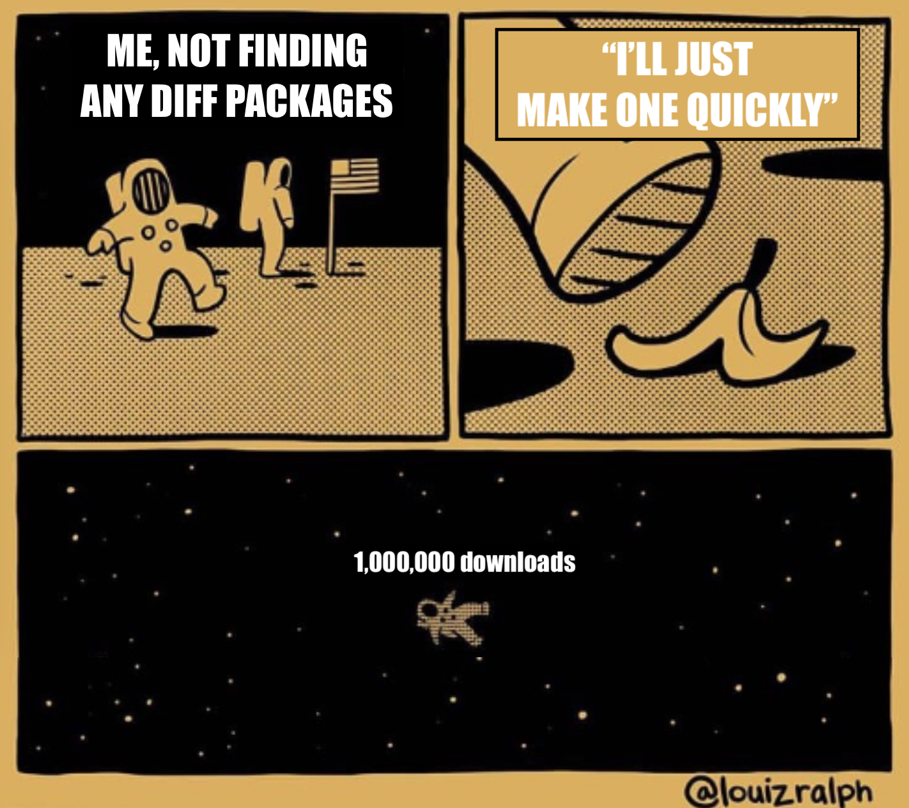
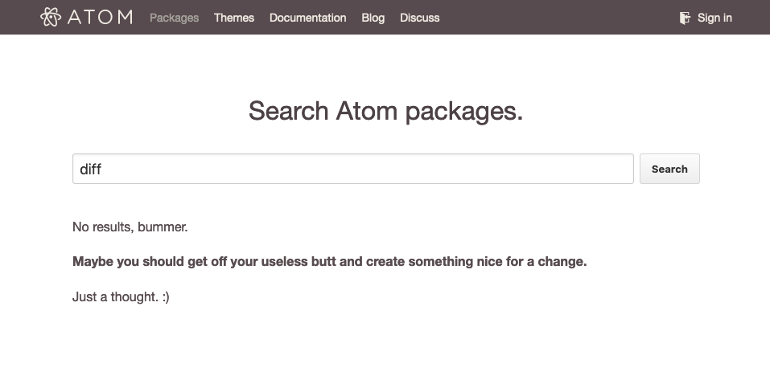
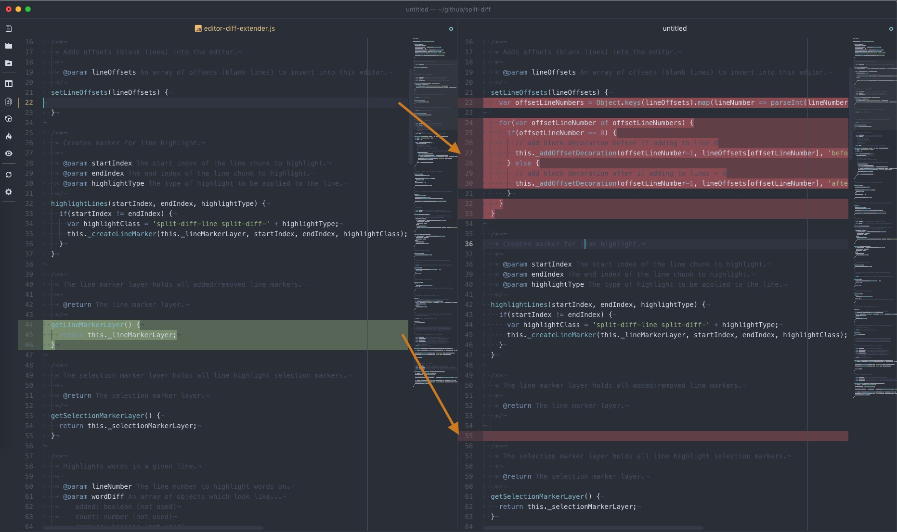
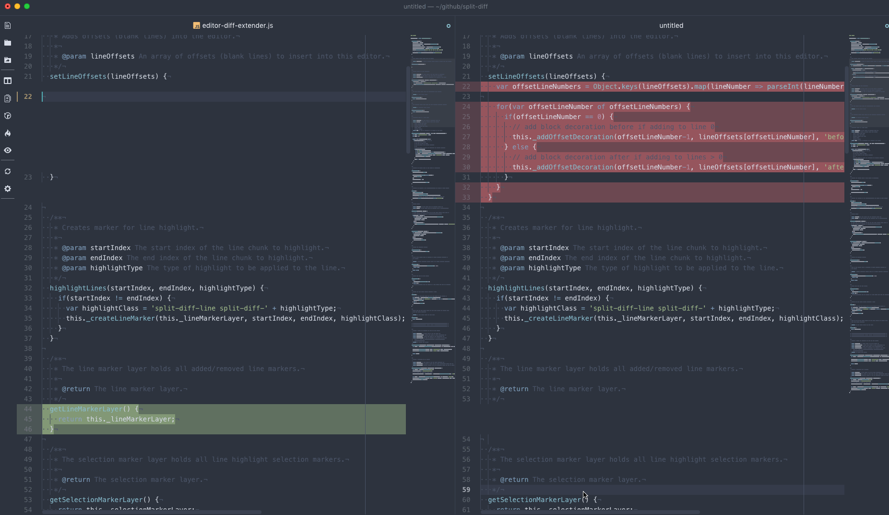
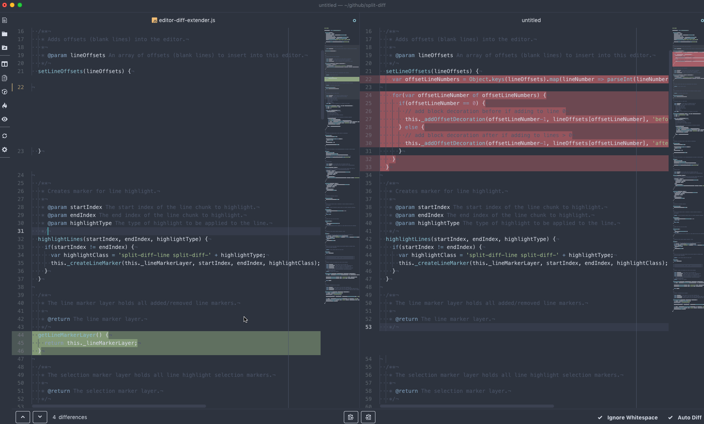

This post is probably long overdue, but at the same time, it's not, because I've never written a blog post before. Nonetheless, I'd like to share my rather accidental rise to OSS - Open Source _Stardom_. A metric that is, of course, measured in Github stars.

[VSCode](https://code.visualstudio.com/) usurped the [Atom text editor](https://atom.io) a while ago now, but there was a long point in time where **if you wanted to compare two files, you had to go through me**. Or, I don't know, use another tool or something, I guess.

## Up and Atom

I was introduced to Atom at my first full-time job. Within a few months of starting, I was pair programming with my team's Tech Lead, and he showed me this new text editor he had set up to his liking.

> I installed these open source packages to improve my workflow, I can write my own JS snippets to do anything, _AND_ I can style any part of the UI with CSS. - Mr. Tech Lead, 2015

I could use skills I had already acquired to customize my work environment. Sold.

Immediately, I changed themes and tried out packages and created JS snippets and wrote CSS. I could bend reality to my will - [my power knew no bounds](https://github.com/mupchrch/outline-selection#outline-selection---). Yes, that was an outline/boundary pun about another package I wrote.

After about a month, I realized a major issue in my workflow. I use MacOS at work. In order to compare two files, I would **boot up a Windows VM** just so I could use WinMerge. Kind of like taking a flight because I wanted some peanuts. This realization spurred me to try every single Atom package that dared to mention the words `compare`, `diff`, or `merge`. Nothing quite fit the bill.

## Hacking the "hackable text editor"

I was floored. How could this free product that just exited Beta not provide exactly what I need? No matter, it should be easy enough to build. I went into research mode. I found a [StackOverflow post](https://stackoverflow.com/a/1313218), which pointed me to a research paper titled [An O(ND) Difference Algorithm and its Variations](http://www.xmailserver.org/diff2.pdf). My eyes glazed over. This was out of my wheelhouse - I could barely vertically align text in a `
`.

But wait, I've seen websites where you can paste in the contents of two files that you want to compare. How do they do it? Hold on, what is [jsdiff](https://github.com/kpdecker/jsdiff)? _Some poor soul already did the dirty work!_ 🎉

I followed Atom's documentation and slapped together a very bare-bones package. At that time, packages were built using [CoffeeScript](https://coffeescript.org/), so I stumbled a bit in the beginning. To be honest, I never fully boarded the CoffeeScript train (and I eventually refactored much of the supporting logic to JavaScript files), but I can appreciate its successful influence on [ES6](https://www.w3schools.com/js/js_es6.asp).

Regarding my new package, [things started out slow](https://github.com/mupchrch/split-diff/commit/59b0676dfa5b53d900ec8fde1c6b833941ffd8c5), but I persevered:

Cool, I'm done. That was quick and easy... Except everything gets misaligned if the number of lines added doesn't equal the number of lines removed! I needed some way to insert "fake lines", so related differences remained properly aligned. The only issue was, at the time, there was _zero_ support for what eventually became "block decorations".

From the eventual block decorations announcement post:

> Users and package authors have come up with hacks that circumvent the problem by monkey-patching DisplayBuffer and the way it constructs tokenized lines.

Guilty 🙋‍♂️

After 3 days of bashing my head against my keyboard, I finally did it. Just kidding, I took some [~slight~ heavy influence](https://github.com/mupchrch/split-diff/blob/9e71b0c53811460d041fa71ab9e5db8820ad61e0/lib/build-lines-helper.js#L5) from a package that Facebook released called Nuclide. Consider me the Robin Hood of side-by-side file comparison.

I also realized how massive of a pain it is to have to scroll both editors separately. Again, [I ~stole~ borrowed a file](https://github.com/mupchrch/split-diff/blob/e24b345715b6af26536af59864182c5944a809b8/lib/sync-scroll.js#L5) from Nuclide, and now the editors' scroll positions were in sync at all times.

## Hello, World!

I named this thing [split-diff](https://github.com/mupchrch/split-diff#split-diff---) and shipped v0.1.0.

I couldn't believe the kind of traction it gained. Something I had created for myself, slowly but surely started racking up a not insignificant amount of downloads. 1,000... 10,000... 100,000... 500,000... and eventually near the end of Atom's life - **1,000,000 downloads** 😱

However, let's not celebrate too soon. Far before all that, myself, and [at least one person in my growing userbase](https://github.com/mupchrch/split-diff/issues/6#issuecomment-211070405), had run into a problem: Diffing large files **completely froze Atom**.

I did some research (the Atom API documentation was fantastic) and found my solution: `BufferedNodeProcess`. This is pretty much what it sounds like — I could run arbitrary JavaScript in a separate Node.js process, write its output to the buffer, and parse it back in the main thread. This freed up Atom to continue actually functioning while I computed the diff results asynchronously. _More importantly_, I could display a loading indicator if the diff was taking longer than 1 second. _MORE importantly_, the user now had the choice to be able to cancel out of this painfully slow package, and even proceed to uninstall it!

## Goodbye, World!

Addressing the UI lockup was what I consider the last interesting issue that I fixed. Although I did go on to add quite a few more features:
- Moving to the next/previous diff "chunk"
- Quickly moving a "chunk" of changes from one editor to the other
- A bottom bar in the UI to show the number of differences and also provide easy buttons for the aforementioned features
- Highlighting which words changed between each line
- Diffing with the previous git commit (if available)

Looking back with my current experience level, there was still a lot of performance to be gained. No dig at `jsdiff`, but it might have been a better idea to call a C/C++ module using the `BufferedProcess` API. I also always wanted to just use the info from `git diff` if it was available, but never had the time or ambition to add another fork in the code.

I'll end this post by sharing the best moment to come out of `split-diff`. At work, we had started hearing rumors that my company was thinking of creating an internal Atom package to help our frontend engineers with some development pain points. My team's Tech Lead (the same one who had introduced me to Atom), was included on a demo of the new package. He noticed the package could compare files... and **it installed `split-diff` to do it**.

> Wait you guys know Mike made that package, right?!

I had poured countless hours into fixing bugs and creating features. I never expected any money or notoriety - I was doing it for free and for fun. Strangely, I was even yelled when things broke. But as it turns out, it literally ended up paying off. That coincidence at work helped advance my career on more than one occasion.
