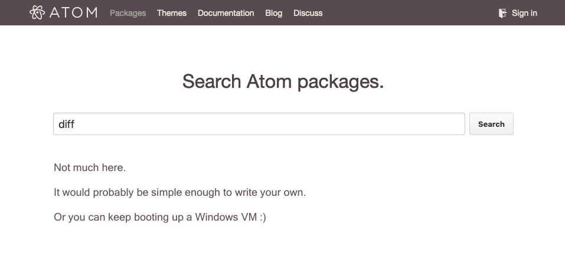

I know the [Atom text editor](https://atom.io) isn't the new hotness right now (I've long since switched to [VSCode](https://code.visualstudio.com/)), but I've just cracked into writing blog posts, and I'd like to share my rather accidental rise to open source "stardom". Stardom, here, is measured in Github stars, of course.

I first encountered Atom as an innocent new hire at my first full-time job. It was a frontend web application development position, which I only had minimal experience in from one of my internships. Anyway, I'm still working there nearly 5 years later, so I guess you could say it went alright.

Within a few months of starting, I was pair programming with a coworker, and when he opened up his text editor, my jaw hit the floor.

> Yeah man, look at these open source packages I installed to improve my workflow. I even wrote a couple of my own JS snippets to change some functionality for my usage. _AND_ I can style whatever I want to my liking with CSS.

Okay, what? I can use what I've learned so far at my job to customize the way my text editor looks and behaves? _Sold._

I had never really paid much attention to my text editor before. I had generally just rolled with whatever opened when I double-clicked a file. I shuddered while writing that sentence — _I thought blog posts were supposed to make me seem cool._

## Let's see what Atom can do

Immediately, I changed themes and tried out packages and created JS snippets and wrote CSS (I mean, as much as anyone really _knows_ how to write CSS). This new world was fantastic. Until it wasn't.

After about a month, I realized a major issue in my workflow. I use MacOS at work. In order to compare two files, I would **BOOT UP MY ENTIRE WINDOWS VM** just so I could use WinMerge. In reflection, I'm baffled that this was a solution I tried even once, let alone for a _month._ This spurred me to go on a rampage trying out every single package that dared to utter the words `compare`, `diff`, or `merge`.

Below, you'll find reviews of each package from the perspective of an inexperienced simpleton:

- One offered diffing changes inline — Gross, I could barely understand when they were side-by-side, now you're going to bring in **a whole different axis**?
- One just highlighted changed line numbers — Okay, what do you expect me to do? **BOOT UP MY ENTIRE WINDOWS VM** to see what changed?
- Wait! One showed me side-by-side changes! — But in a popup... that I couldn't edit ☹️

## Hacking the "hackable text editor"

I was floored. How could what I want not exist? (For one, Atom had just exited Beta.) There had always been a package for what I needed. I went into research mode. I found a [StackOverflow post](https://stackoverflow.com/a/1313218), which pointed me to a research paper titled [An O(ND) Difference Algorithm and its Variations](http://www.xmailserver.org/diff2.pdf). Nah. I'm good. I can barely vertically align text in a `
`. This is getting a little too college right now.

Wait a second. I've seen websites where you can paste in the contents of two files that you want to compare. How do they do it? ...What is [jsdiff](https://github.com/kpdecker/jsdiff)? _Some poor soul already did the dirty work!_ 🎉 (Seriously, a _huge_ shoutout to [Kevin Decker](https://github.com/kpdecker).)

I followed the documentation and slapped together an initial "Hello, World" package. At the time, packages were built using [CoffeeScript](https://coffeescript.org/), so I stumbled a bit in the beginning. [Things started slow](https://github.com/mupchrch/split-diff/commit/59b0676dfa5b53d900ec8fde1c6b833941ffd8c5), but I persevered:

Cool, I accomplished what I set out to do... Hold on, everything gets out of whack if the number of lines added doesn't equal the number of lines removed! I needed some way to insert "fake" lines, so related differences remained properly aligned. The only issue was, at the time, there was _zero_ support for what is now called "[block decorations](https://blog.atom.io/2016/02/03/introducing-block-decorations.html)".

From the block decorations announcement post:

> Users and package authors have come up with hacks that circumvent the problem by monkey-patching DisplayBuffer and the way it constructs tokenized lines.

Guilty 🙋‍♂️

After 3 days of bashing my head against my keyboard, I finally did it. Just kidding, I took some [slight influence](https://github.com/mupchrch/split-diff/blob/9e71b0c53811460d041fa71ab9e5db8820ad61e0/lib/build-lines-helper.js#L5) from a package that Facebook released called Nuclide. I know what you're thinking, I'm basically the Robin Hood of side-by-side file comparison. It gets better.

I also realized how massive of a pain it is to have to scroll both editors separately. Again, I took a [small bit of influence](https://github.com/mupchrch/split-diff/blob/e24b345715b6af26536af59864182c5944a809b8/lib/sync-scroll.js#L5) from Nuclide, and now the editors scroll positions were in sync at all times.

## Ship it

After adding the ability to recalculate the diff following any changes, I named this thing [split-diff](https://atom.io/packages/split-diff) and shipped v0.1.0. 🚢

Shortly thereafter, myself and [at least one person in my growing userbase](https://github.com/mupchrch/split-diff/issues/6#issuecomment-211070405) ran into a problem. Diffing large files _completely froze Atom_.

I did some research (the [Atom API documentation](https://flight-manual.atom.io/api) was, and is, fantastic) and found my solution: `BufferedNodeProcess`. This is pretty much what it sounds like — I could run arbitrary JavaScript in a separate Node.js process, write its output to the buffer, and parse it back in the main thread. This freed up Atom to continue actually functioning while I computed the diff results asynchronously. _More importantly_, I could display a loading indicator if the diff was taking longer than 1 second. _MORE importantly_, the user now had the choice to be able to cancel out of this painfully slow package, and even proceed to uninstall it!

Addressing the UI lockup was what I consider the last interesting issue that I fixed. I went on to add quite a few more features:
- Moving to the next/previous diff "chunk"
- Quickly moving a "chunk" of changes from one editor to the other
- A bottom bar in the UI to show the number of differences and also provide easy buttons for the previous features
- Highlighting which words changed between each line
- Diffing with the previous git commit (if available)

Looking back with my current experience level, I would have focused even further on performance. No dig at `jsdiff`, but it might have been a better idea to call a C/C++ module using the `BufferedProcess` API. I also always wanted to just use the info from `git diff` if it was available, but never had the time or ambition to add another fork in the code.

Unfortunately, I've long since been in maintenance mode on split-diff (apparently, I had ["more important" things to do](https://www.instagram.com/monthlymammals/)). I've had fun, failure, and feature creep, but I think it all resulted in a package with a really solid user experience. I definitely learned how to say "no, that's not in scope" for this tool. It's okay to have an accomplishable goal and stick to it — you don't have to build a Swiss Army knife.