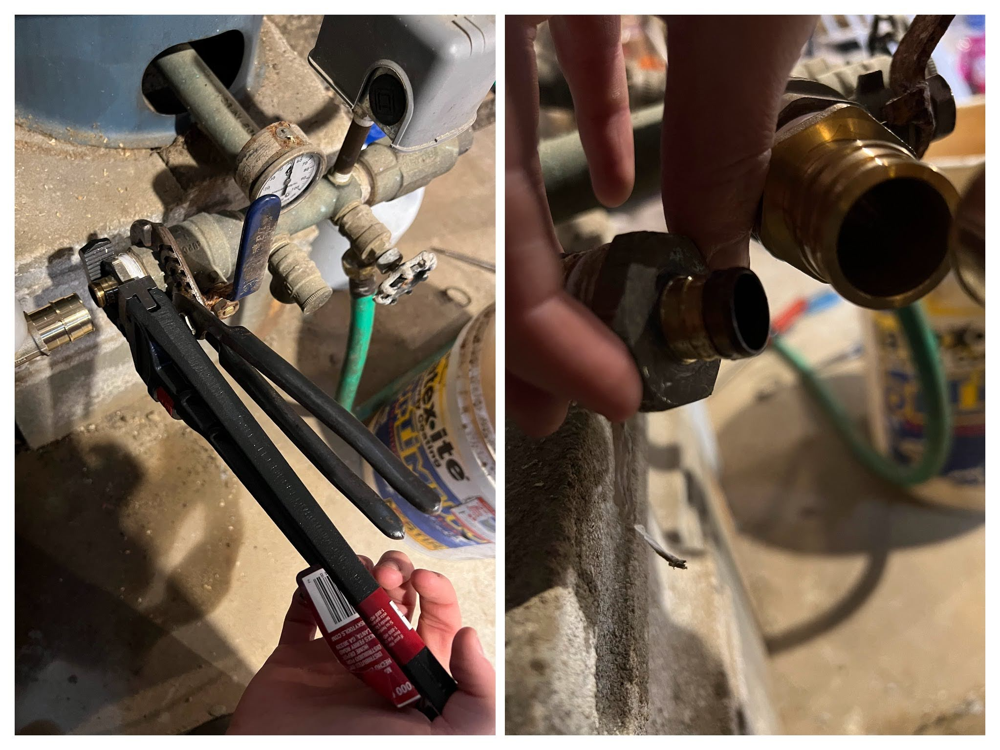

My wife and I purchased our first house this year. A couple of months after moving in, we started to notice a rotten egg odor coming from our water. We had a water test done before purchasing the house, so it left a bad taste in our mouths. Thankfully, only metaphorically.

## Diagnosing the source of the stink

I called a local well company and then employed the scientific method in the mean time. The smell was coming from both hot and cold water - this ruled out any bacteria growing in the hot water heater. Also, we have a tankless water heater, so if there was any doubt before, it _definitely_ wasn't the culprit.

Next item of investigation - water softener. Could it be adding the smell? Let's check the water from the spigot in the basement that is _just_ after the water enters the house from the well. Verdict: stinky.

    

        Ok, so if the well water smells, how is it that we made it a couple months before experiencing this unpleasantness?
    

    

        

            For starters, let's "regenerate" the water softener to see if it is able to remove the smell when it's in tip-top shape. A water softener flows water over resin beads to remove unwanted minerals. Once the resin beads are sufficiently "gunked up", the regeneration cycle of a softener backwashes a bunch of salty water over the resin beads to clean them and then dumps it outside the house.
        

        

            After regeneration, the egg smell in the water is gone, but only for a day or two. Interesting. But that means this wasn't what was stopping the smell for the first couple months. And on top of that, I definitely don't want to regenerate my softener every single day - that would waste an incredible amount of water.
        

        

            It was around this point where the well company arrived. They agreed with what we know so far, and they suggested that perhaps the small cartridge filter was enough to remove the smell for a bit.
        

        

            They did a water test from the well water directly - before the softener. Because we had a test from when we purchased the house, we could compare before and after the softener. Good to have readings from both ends. Ultimately, the iron readings were on the lower end, so they were looking for the presence of manganese, but ultimately, the test came back negative.
        

    

The conclusion from the well company was that our water contains Hydrogen Sulfide gas (H2S) - something that wouldn't show up in a test. This is because the gas will immediately begin separating from the water upon collection.

It's something we can easily verify by collecting water in a drinking glass and then letting it sit out. The gas will remove itself from the water over time and the smell will eventually go away.

The well company suggested an aeration system. After a bit of research, it's not difficult to purchase and install - I'll give it a shot.

## Concocting a plan

To begin, let's take a look at the current plumbing setup, which is where water enters from the well, gets pressurized, goes through a sediment filter, and then a softener.

It's a bit of an odd rollercoaster loop. And it's [pex](https://en.wikipedia.org/wiki/Cross-linked_polyethylene) _and_ copper, with some interesting transitions. It's like the rollercoaster is half wooden track, half steel track - I wouldn't ride it.

I think there's a few key things we can improve with this re-pipe:

1. Better layout
    - Easier to understand
    - Easy access to sediment filter for changes
    - Saves us floor space
2. Pex A instead of pex B + copper
    - Pex B fittings _can_ reduce flow rate
3. Better sediment filter - why not?
    - I went with [the Pentair Pentek Big Clear](https://amzn.to/3NqURj8) - Don't forget the [cartridge](https://amzn.to/3RDUWCx), [wrench](https://amzn.to/3tekMDE), and [mounting bracket](https://amzn.to/3tekcFY)! (We'll need to mount it since pex isn't rigid)
3. Add an off-shoot for garden hose bib (We have none!)
4. And of course, we're adding [an aeration filter](https://www.purewaterproducts.com/products/st011)

So after a couple of (even more complex) iterations, I came up with the following plan.

It shouldn't be too bad! Although it did take me a bit of time to figure out which fittings I needed to make the connections between pipes/devices. For tools, I needed [a pipe cutter](https://amzn.to/3GDzOpN), and a pex A expansion tool. I went with [the manual one](https://www.homedepot.com/p/Apollo-PEX-A-Expansion-Tool-Kit-with-1-2-in-3-4-in-and-1-in-Expander-Heads-EPXTOOLKIT/302742804) (used from eBay) as I'm not planning to become a professional :)

## Plumbing

To minimize down time, I'll be installing as much as I can alongside the existing system, and then doing the switch over at the last possible minute. The first step is to install the new sediment filter. This meant adding something to mount it to - some scrap wood I had from the [shed build](/blog/shed-build). After that, we have the water shutoff valve, which also needed mounting. I got a valve with mounting holes specifically for this purpose.

It takes some muscle to use the expansion tool. I'd definitely get the electric one if I was doing a whole house.

Next up, we'll tee off for the hose bib. I left extra pipe just in case, since we'll be installing the spigot in the spring. I already had purchased the Sharkbite fitting and the pex B pipe for a hose install far before I planned this bigger project, so it made sense to use that here, despite it not being ideal. It also made it easier for me to transition between these two types of pipe, _and_ so I didn't have to buy any pex B crimping supplies.

I also piped two 90 degree transitions into and out of the new aeration filter.

Next, I piped from the new filter to where the softener would be. The softener uses a different valve assembly from the new filter - Clack instead of Fleck, so I was able to find [these fittings](https://amzn.to/3GGoadJ), which handled the 90 degree transition into and out of the device. On the Fleck, I had to plumb the 90 degree transition myself - not bad at all, but something I had to plan for.

The rest of the piping above was fairly straightforward. I was able to put two 90 degree bends instead of 90 degree fittings - bends are better for flow.

I cut the old pex/copper piping out along with the old sediment filter. Removing the fitting on the well outlet was difficult - I had to buy I pipe wrench for that (New tool! 🎉). Also, it's crazy to see the difference in fitting size.

And just like that, we're done!

